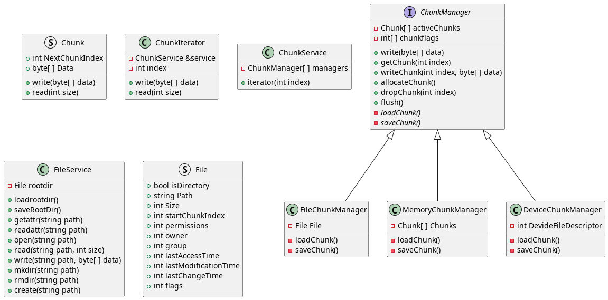

# Unified FileSystems

## Graduation Project - CSE 495 Intermaediate Presentation

> Presented by **Emirhan Altunel**
> Advisor **Dr. Gökhan Kaya**

---

# Contents

1. Introduction
2. What has been done?
3. What will be done?
4. Difficulties Encountered
5. Class Diagrams

---

# Introduction

- **Unified FileSystems** is a project that aims to provide a unified interface for multiple file storage services.
- The project is developed in **C++** language and uses **libfuse** library to create a virtual file system.
- The project is developed for **Linux** operating system.
- The project aims to use **Memory**, **File** and **Physical Storages** as a single storage.
- The project is also aimed to provide faster file read/write due to the use of parallel writing.

---

# What has been done?

- **Chunk Manager Service** has been developed. This service is responsible for dividing the file into chunks and distributing them to the storage services. It also put a software layer between the file system and the storage services.
- **Memory Storage Service**, **File Storage Service** and **Physical Storage Service** have been developed. These services are responsible for storing the chunks in the memory, file and physical storage respectively.

- **File System Structure** has been created.

---

# What will be done?

- **File System Service** will be developed. This service will be responsible for managing the files and directories in the file system.

- **Encryption Service** will be developed. This service will be responsible for encrypting and decrypting the data and keeping the keys.

- **User Interface** will be developed. This interface will be responsible for providing a user-friendly interface for the file system.

---

# Difficulties Encountered

- Direct writing to the physical storage is complicatin and take more time than I expected.

- The use of **libfuse** library is written in **C** language and less documented. This makes it difficult to understand and write safe code.

- Implementing the **directories** in the file system is more complicated than I expected. Pretending them as files make it easier to implement.

---

# Class Diagrams

