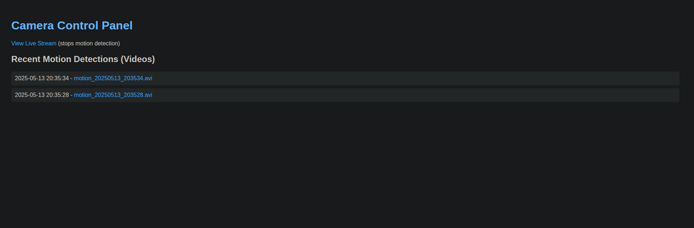
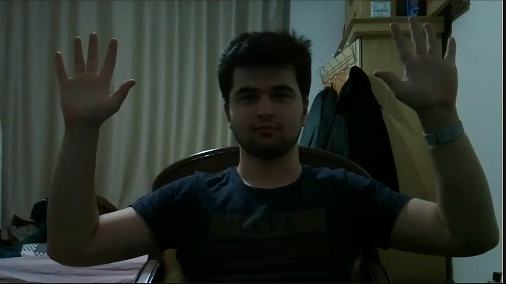

<!-- markdownlint-disable MD033 MD025-->

# Mini Security Camera

## Graduation Project - CSE 496 Second Presentation

> Presented by **Emirhan Altunel**
> Advisor **Dr. Öğr. Üyesi Alp Arslan BAYRAKÇİ**

---

# Contents

1. Introduction
2. What has been done?
3. What will be done?
4. Difficulties Encountered

---

# Introduction

- Mini Security Camera is designed to detect the motion and record the video when a motion is detected.
- It should also support live streaming.
- The objects in the video should be classified and the classification results also served to the user.

---

# What has been done?

- **Simple Web UI** to watch live and download the recorded videos. Also simple **Flutter App** to watch live and see the videos.
- **Motion Detection** has been implemented. The camera record a 5-second video when a motion is detected.
- **Live Streaming** has been implemented. When user request live stream, the camera stop recording and enter the live stream mode.

---

# What will be done?

- **Object Detection** will be implemented. The camera will classify the objects in the video and store the classification results. I am currently planning to not use real-time object detection. Instead, I will use the classification results of the recorded videos. Because RPI Zero 2 is not powerful enough.
- **Audio Support** will be added. The camera will record the audio along with the video. Also in live stream mode, the audio will be transmitted to the user. Also the audio of user will be transmitted to the camera's speaker.
- **Enclosure** will be designed. The camera will be placed in a box to protect it and has a cooling system.

---

# Difficulties Encountered

- The **Raspberry Pi Zero 2** is not powerful enough to do a lot of things at the same time.
- **Heat dissipation** is a problem. The RPI gets too hot even it doesn't accomplish anything.
- **Compile time** is taking too long. Small changes in the code require 3 minutes of compile time. I tried parallel compilation, but it didn't work. I also attempted to use cross-compilation, but I was unable to make it work.

---

# Recorded Videos

---

# Live Stream

